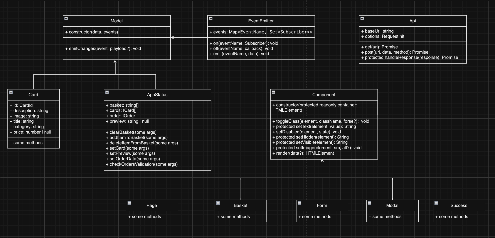

# Project "Web Larёk" (from russian Larёk - kiosk/Späti )

The online store with goods for web developers - Web kiosk. You can view the product catalog, add products to the cart and place an order.

## Features
- Product catalog
- Shopping cart
- Order placement

## Tech Stack
- HTML
- SCSS
- TypeScript
- Webpack

API: https://larek-api.nomoreparties.co

Due to the fact that the server data is in Russian, an API (deepl) was used to translate the data.

## Project structure
- src/ — project source files
- src/components/ — folder with JS components
- src/components/base/ — base code folder

Important files:
- src/pages/index.html — HTML-file of main page
- src/types/index.ts — types file
- src/index.ts — application entry point
- src/styles/styles.scss — root style file
- src/utils/constants.ts — file with constants
- src/utils/utils.ts — utility file

## Installation and launch
To install and run the project you need to run the commands


```
npm install
npm run start
```

or

```
yarn
yarn start
```
## Building the project

```
npm run build
```

or

```
yarn build
```

## Architecture


For a detailed description of the architecture, see [ARCHITECTURE.md](./ARCHITECTURE.md).

